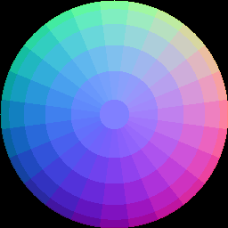

# Normsphere
## Description
Generate a sphere of tangent-space normals for use in hand-painting normal maps.

## Usage
    normsphere [OPTIONS]

### Options

| Short | Long                  | Description                                                                                                  |
| ----- | --------------------- | ------------------------------------------------------------------------------------------------------------ |
| `-s`  | `--size <SIZE>      ` | Pixel width and height of the resulting image [default: 256]                                                 |
| `-a`  | `--angle <ANGLE>    ` | Angle step in degrees in azimuth and inclination [default: 15]                                               |
| `-o`  | `--outfile <OUTFILE>` | Path to write output image. Format determined by extension using the `image` crate [default: normsphere.png] |
| `-h`  | `--help`              | Print help                                                                                                   |
| `-V`  | `--version          ` | Print version                                                                                                |

## Example

    normsphere -s 256 -a 15

